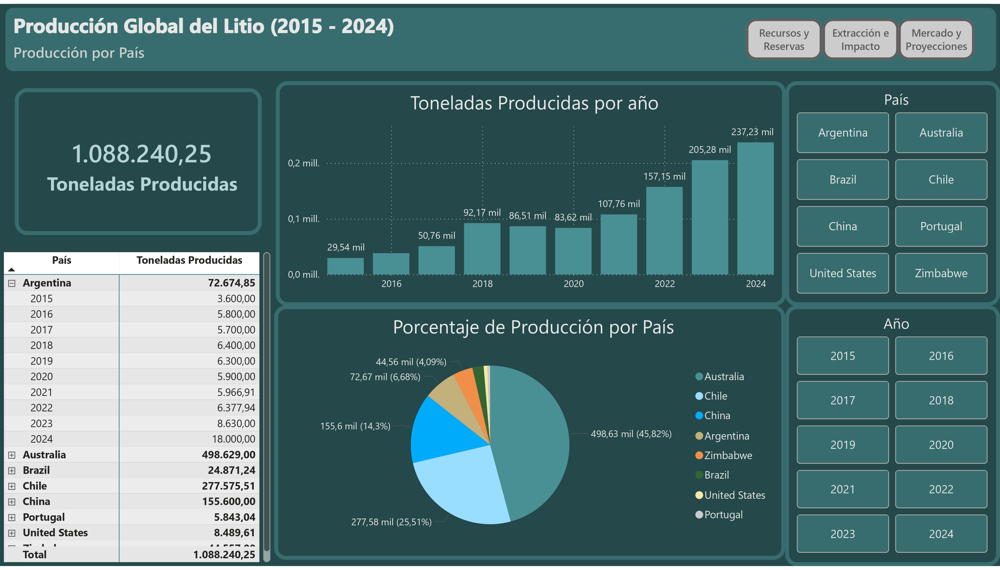
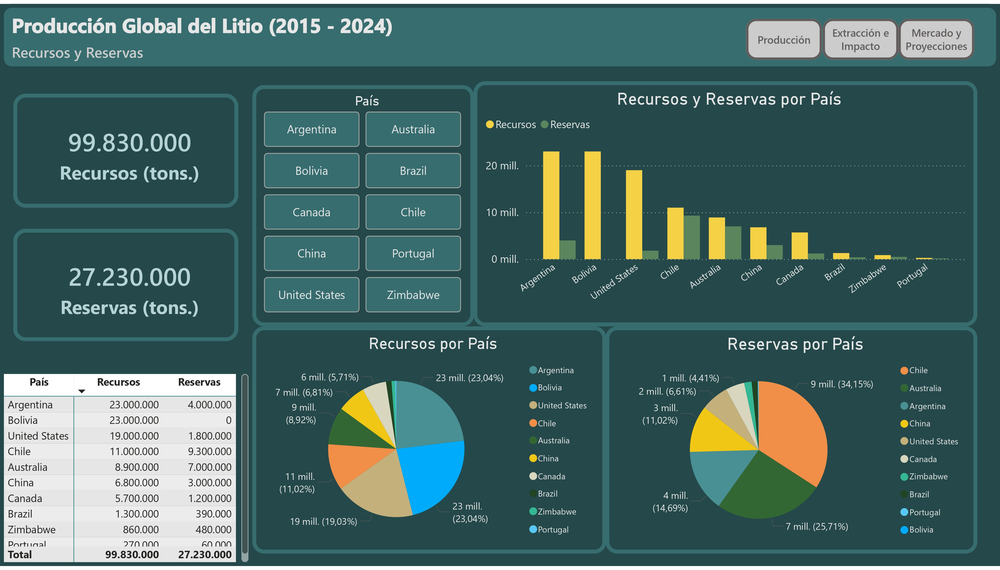
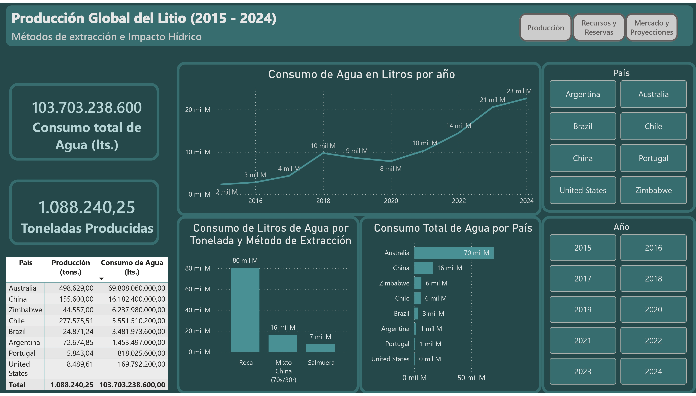
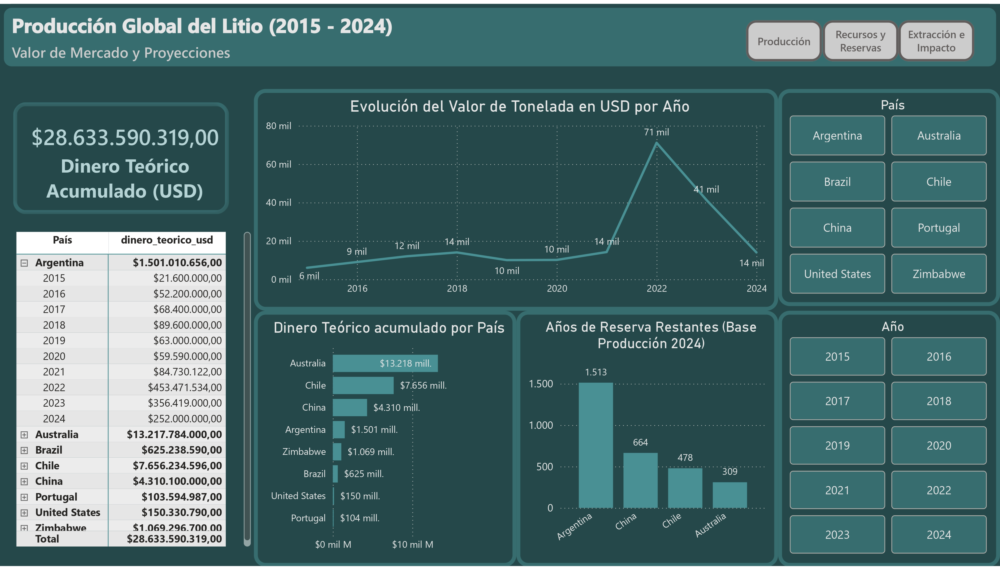

# Producción del Litio: Extracción, Reservas, Impacto Hídrico y Proyección (2015-2024)

## Descripción General del Proyecto
Proyecto de ingeniería y análisis de datos sobre el mercado global de extracción de litio.

* **Objetivo del proyecto:** Visualizar la producción histórica, el futuro de las reservas y el costo hídrico asociado a los distintos métodos de extracción de litio a nivel global.
Este análisis tiene un fin estrictamente informativo y descriptivo. No busca politizar ni emitir juicios de valor sobre la explotación de recursos o contaminación, sino proporcionar datos para que cada quién saque sus propias conclusiones.

* **Contexto del análisis:** El análisis abarca la producción de los 10 principales países actores del mercado entre los años 2015 y 2024.

## Investigación Previa y Recopilación de Datos
Los datos crudos provienen de tres fuentes documentales distintas:

* **Producción Histórica:** Extraído de *Our World in Data* (Lithium Production). (Formato: CSV). https://ourworldindata.org/grapher/lithium-production
* **Precios, Recursos y Reservas:** *USGS Mineral Commodity Summaries, Lithium (Enero 2025)*. https://pubs.usgs.gov/periodicals/mcs2025/mcs2025-lithium.pdf
* **Impacto Hídrico:** Paper científico extraído de *ScienceDirect* ("Comparative Life Cycle Assessment of Lithium Mining, Extraction, and Refining Technologies: a Global Perspective"). https://www.sciencedirect.com/science/article/pii/S2212827123001130

### Supuestos iniciales y Reglas de Negocio:
* **Eficiencia hídrica:** Se asume un consumo de 20.000 L/Ton para extracción por Salmuera y 140.000 L/Ton para extracción en Roca.
* **Limitaciones del dataset:** Los precios históricos (USD/Ton) se asumen estandarizados a nivel global por año.  No se cuenta con el precio exacto de venta/exportación aislado por cada país.

## Stack Tecnológico
* **Python (ETL):** Utilizado para extracción, filtrado y carga de datos.
  * pandas: Transformación de datos crudos, filtrado de países  y limpieza de columnas.
  * sqlalchemy: Conexión a SQL Server
* **SQL Server:** Motor de base de datos relacional local.
* **Power BI Desktop:** Consumo de la base de datos SQL para la creación y diseño del tablero.
* **Git / GitHub:** Control de versiones y despliegue.

## Arquitectura y Flujo del Proyecto

1. **Fuentes:** Lectura del archivo lithium-production.csv alojado de forma local.
2. **Transformación:** Limpieza de estructura, estandarización de nombres, descarte de regiones agrupadas (ej. "Asia", "Europe") para aislar países específicos, y generación de dataframes.
3. **Carga (SQL Server):** Ejecución de scripts DDL (`01_creartablas.sql`) para preparar el esquema.
4. **Capa Semántica:** Conexión al motor SQL para el modelado final.

## Modelado de Datos
El proyecto implementa un esquema de estrella centralizado:

* **Tabla de Hechos:** `fact_produccion` (Producción anual por país).
* **Tablas de Dimensiones:**
  * `dim_pais_detalles`: Almacena métricas estáticas de recursos y reservas.
  * `dim_metodo_extraccion`: Cataloga el tipo de mina y su factor de uso de agua.
  * `dim_precios`: Histórico de precios por año.

## Complicaciones Encontradas y Soluciones
* **Ambigüedad de Datos:** China presenta un modelo de extracción mixto (mayoritariamente roca, pero con vastas reservas de salmuera).
  * *Solución aplicada:* Se creó un método de extracción sintético "Mixto China (70s/30r)" asumiendo un peso ponderado de 70% roca y 30% salmuera, resultando en una tasa de 104.000 Litros/Ton. 

## Visualización y Análisis
El dashboard consta de 4 páginas:

1. **Producción:** Análisis descriptivo del volumen histórico extraído por país.

2. **Recursos y Reservas:** Contraste del litio económicamente viable para su extracción(Reservas) vs. el geológicamente disponible (Recursos).

3. **Impacto Hídrico:** Cruce del volumen productivo con el método de extracción y el uso del agua. 

4. **Valor de Mercado y Proyecciones:** Cálculo del "Dinero Teórico" histórico y predicción matemática de vida útil de las minas si se mantiene el ritmo de extracción del año base (2024).

## Resultados y Conclusiones
*  Países con alta producción actual a través de roca asumen un costo hídrico muy superior a los productores de salmuera.
*  Se evidencia una disparidad en la sostenibilidad a largo plazo entre los distintos productores.
* Se evidencia un pico de precios en los años 2022-2023, independiente de los picos de producción.

## Cómo Ejecutar el Proyecto

**Requisitos Previos:** Python 3.9+, SQL Server instalado localmente, ODBC Driver 17, Power BI Desktop.

1. Clonar el repositorio.
2. Abrir SQL Server Management Studio (SSMS) y ejecutar el script `sql_scripts/01_creartablas.sql` para crear la DB `LitioDB` y su esquema.
3. Modificar el archivo `etl_final.py` ajustando la variable `SERVER_NAME` con el nombre de tu servidor SQL local, y la ruta del CSV en la lectura de Pandas.
4. Ejecutar el entorno virtual e instalar dependencias:
  `pip install pandas sqlalchemy pyodbc`
5. Ejecutar el script principal:
   `python notebooks/etl_final.py`
6. Abrir el archivo `.pbix` en Power BI Desktop y refrescar los datos.

## Propósito del Proyecto

Este proyecto ha sido desarrollado como portafolio para demostrar capacidades técnicas en Ingeniería de Datos (ETL con Python/SQL) y Análisis de Datos (Power BI).
